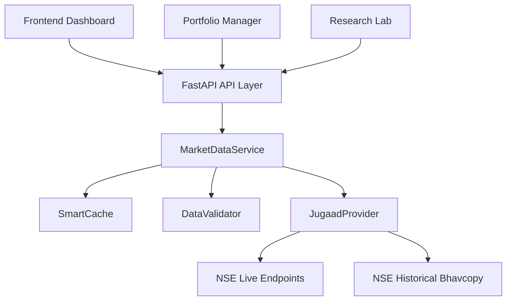

# Market Data Platform (Phase P1)

## Architecture Overview
The Market Data Platform acts as the singular source of truth for the entire AI Trading Platform. All components (Portfolio Manager, Recommendation Engine, Research Lab) must fetch live and historical market data exclusively through this gateway.

## Key Components

1. **MarketDataService**
The orchestrator. It checks the cache, invokes providers, validates the response, and caches the clean data.

2. **MarketDataProvider Interface**
An exhaustive abstraction layer ensuring the system is strictly provider-agnostic. Currently implemented by `JugaadProvider`.

3. **DataValidator**
Ensures no bad data (e.g. negative prices, malformed JSON) ever enters the downstream AI pipelines.

4. **SmartCache**
Utilizes TTLCache to hold live prices for 60 seconds and historical data permanently in memory to prevent rate-limiting.

5. **Scheduler (APScheduler)**
Automates EOD data ingestion, symbol synchronization, and gap detection.
