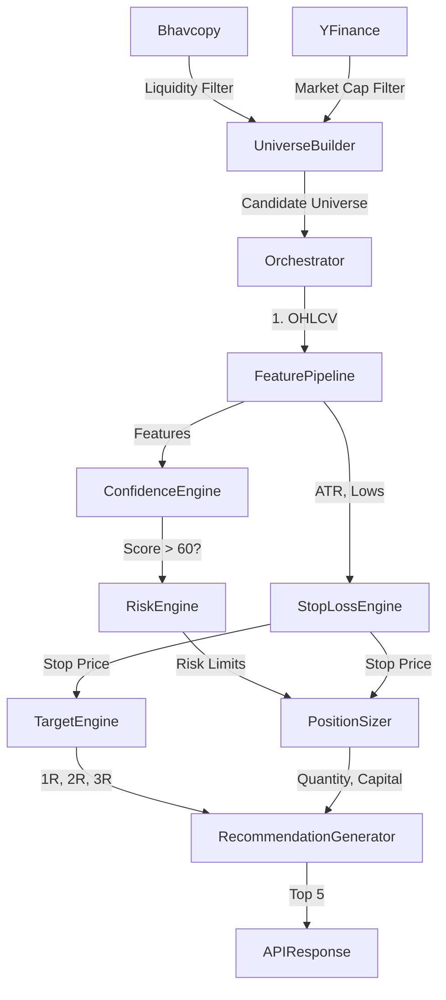

# Phase 1: Institutional Recommendation Engine

This document outlines the Phase 1 implementation of the Institutional Recommendation Engine for the AI Trading Platform. It focuses on sophisticated filtering, dynamic risk sizing, and confidence scoring.

## Architecture Updates

A new `app/recommendations` module has been introduced, acting as a secondary layer above the raw Discovery and Feature Pipelines. 

**Core Components:**
1. **Smart Universe Builder**: Replaces flat discovery. Uses NSE Bhavcopy for liquidity filtering, followed by concurrent `yfinance` fetches for market cap and sector data.
2. **Dynamic Risk Engine**: Determines maximum capital allocation and monetary risk per trade based on portfolio limits.
3. **ATR Stop Loss Engine**: Calculates safe stops utilizing 14-day ATR, recent swing lows, and structural support to prevent premature stop outs.
4. **Position Sizing Engine**: Converts the target risk into exact whole-share quantities, capped by buying power and portfolio concentration limits.
5. **Target Engine**: Generates 1R, 2R, and 3R target prices.
6. **Confidence Engine**: A purely quantitative scorer evaluating Trend, Momentum, Volume, and Volatility to assign an A+ to D grade for the setup.
7. **Orchestrator**: Ties all components together into the `RecommendationEngine`.

## Data Flow



## Configuration Guide

The recommendation engine is entirely configurable via `config/trading.yaml`.

```yaml
universe_filters:
  minimum_price: 50
  minimum_market_cap: 30000000000 # 3000 Crores
  # ... other filters
  
risk_management:
  atr_multiplier: 1.5
  max_portfolio_risk_percent: 2.0
  max_position_allocation_percent: 10.0
```
- Adjust `atr_multiplier` for tighter (1.0) or looser (2.0+) stops.
- `max_portfolio_risk_percent` ensures you never lose more than X% of your total account on a single bad trade.

## API Documentation

### `GET /api/recommendations`

Fetches the top institutional-grade recommendations.

**Parameters:**
- `capital` (float, required): Total portfolio capital.
- `risk_percent` (float, optional): Override the max risk per trade.
- `max_positions` (int, optional): Override the max recommendations returned.

**Response:**
```json
{
  "generated_at": "2023-10-27T10:00:00Z",
  "portfolio_capital": 500000,
  "recommendations": [
    {
      "Ticker": "RELIANCE.NS",
      "Recommended_Entry": 2500,
      "Stop_Loss": 2400,
      "Target_1": 2600,
      "Recommended_Quantity": 50,
      "Capital_Required": 125000,
      "Confidence_Grade": "A+"
      // ...
    }
  ]
}
```

## Extension Points for Phase 2

For Phase 2 (Multi-Timeframe Analysis, Relative Strength, Sector Rotation), the following extension points are available:
- **Sector Rotation**: Can be added as a filter in the `SmartUniverseBuilder` to only return stocks from strong sectors.
- **Relative Strength**: Can be added as an indicator in `FeaturePipeline` and given a 20% weight in the `ConfidenceEngine`.
- **Advanced Pattern Detection**: Can be integrated into the `FeaturePipeline` (e.g. `is_cup_and_handle`).
