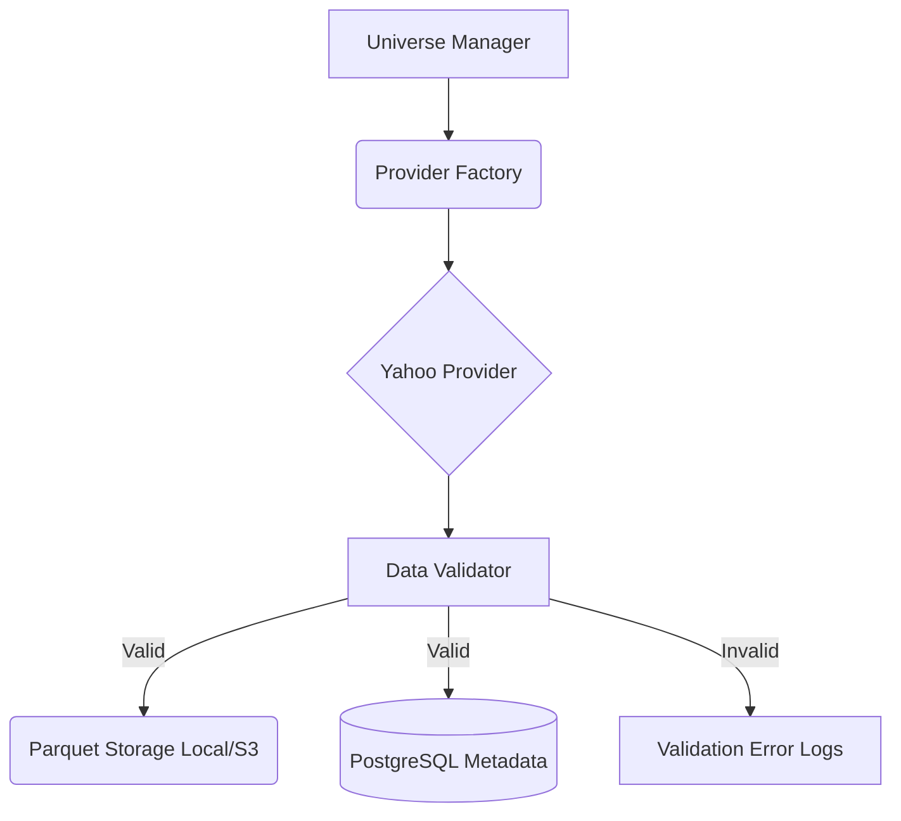

# Phase D1: Historical Data Lake & Market Data Foundation

## Overview
Phase D1 establishes a production-grade **Historical Data Platform** serving as the single source of truth for all historical market data. It handles downloading, validation, storage, and incremental updating for the complete NSE equity universe. This decouples the trading logic (Phases 1-12) from external data provider APIs, preventing rate limits and data inconsistency.

## Architecture



### Core Components
1. **Universe Manager** (`backend/data_platform/universe/`)
   - Tracks active symbols, delistings, and ISIN mappings.
2. **Provider Abstraction** (`backend/data_platform/providers/`)
   - Replaces direct `yfinance` calls scattered across the app. Implements `BaseProvider`.
3. **Data Validators** (`backend/data_platform/validation/`)
   - Blocks corrupt data (High < Low, negative prices, 5+ day gaps, duplicates).
4. **Storage Managers** (`backend/data_platform/storage/`)
   - **ParquetManager**: Saves immutable OHLCV data using `pyarrow` and Snappy compression.
   - **PostgresManager**: Tracks metadata (download state, timestamps, row counts) via SQLAlchemy.
5. **Data Orchestrator** (`backend/data_platform/services/`)
   - Exposes asynchronous task schedulers for Bootstrap (10-year download) and Incremental (daily appends).

## Workflow

### 1. Bootstrap
Triggered via `POST /api/data/bootstrap`. The `HistoricalLoader` loops through the active universe, downloads 10 years of data from the provider, runs validation, saves to `.parquet`, and marks the sync state in the DB. Uses exponential backoff for rate limits.

### 2. Incremental Update
Triggered via `POST /api/data/update`. The `IncrementalLoader` reads the `last_date` from the DB metadata, fetches only the new days, validates, and *appends* to the existing Parquet file.

## Configuration
Controlled via `backend/config/historical_data.yaml`:
```yaml
historical_data:
  active_provider: "yahoo"
  download:
    batch_size: 50
    retry_count: 5
  storage:
    base_path: "data/historical_lake"
```
