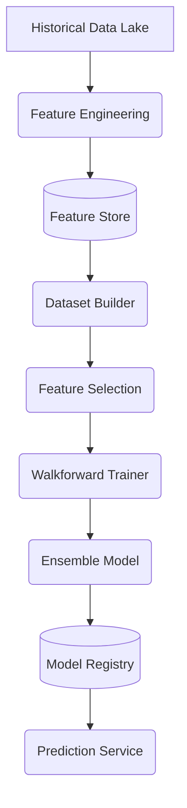

# Phase D2: ML Platform, Feature Store & AI Model Training

## Overview
Phase D2 establishes a production-grade Machine Learning Platform on top of the Historical Data Lake (Phase D1). It is responsible for transforming raw data into ML-ready features, storing them efficiently to avoid recomputation, generating datasets devoid of leakage, training an ensemble of tree-based models, and serving predictions.

## Architecture

### Core Components
1. **Feature Engineering** (`backend/ml_platform/feature_engineering/`)
   - Computes Trend (EMA, SMA, RSI, MACD), Volatility (ATR, BB), Volume (OBV, VWAP), and Price Action features natively using pandas/numpy for vectorized performance.
2. **Feature Store** (`backend/ml_platform/feature_store/`)
   - **FeatureRegistry**: Tracks metadata and versions of engineered features.
   - **FeatureCache**: Persists generated feature dataframes to Parquet, acting as the canonical source for both Training and live Prediction (zero redundant computation).
3. **Datasets & Labels** (`backend/ml_platform/datasets/`)
   - **LabelGenerator**: Computes 5-day and 7-day forward return labels and classifications (Strong Buy, Buy, Hold, etc.) strictly shifting backwards to avoid future leaks.
   - **DatasetBuilder**: Joins features with targets.
   - **DataSplitter**: Implements Walk-Forward Validation yielding non-overlapping chronological splits.
   - **LeakageDetector**: Throws critical errors if target columns accidentally appear in the feature matrix.
4. **Feature Selection** (`backend/ml_platform/feature_selection/`)
   - **CorrelationFilter**: Drops highly correlated features (Pearson > 0.95) to reduce multicollinearity.
   - **FeatureRanker**: Extracts built-in tree importances.
5. **Training & Validation** (`backend/ml_platform/training/`)
   - **EnsembleTrainer**: A `VotingClassifier` consisting of `LightGBM`, `XGBoost`, and `CatBoost` predicting probability.
   - **ModelValidator**: Validates accuracy, precision, recall, F1, ROC AUC, and Brier Score.
6. **Registry & Prediction** (`backend/ml_platform/registry/`, `backend/ml_platform/prediction/`)
   - **ModelRegistry**: Tracks trained `.joblib` models and metadata in `data/model_registry`. Manages `STAGING` and `PRODUCTION` states.
   - **PredictionService**: Given a symbol, fetches the very latest row from the Feature Store, passes it through the production model, and returns a JSON schema containing the predicted class and probability distribution.

## APIs Exposed
- `GET /api/ml/features`: List all registered features.
- `GET /api/ml/models`: List models in the registry.
- `GET /api/ml/predictions/{symbol}`: Returns live predictions using cached features.
- `POST /api/ml/train`: Triggers the walk-forward training pipeline.
- `POST /api/ml/validate`: Triggers model validation.

## Configuration
Controlled via `backend/config/ml_platform.yaml`:
- Horizons, class thresholds, ensemble settings, Walkforward windows, and registry paths.
