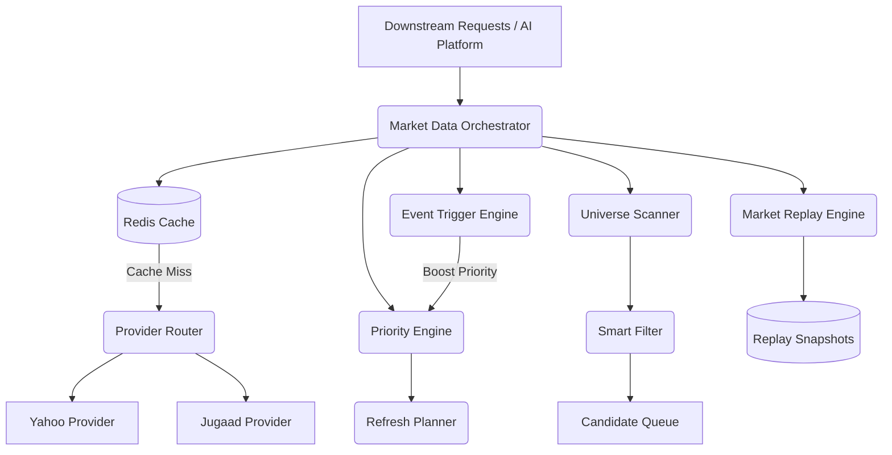

# Phase D3: Smart Market Data Orchestrator & Intelligent Intraday Platform

## Overview
The Smart Market Data Orchestrator is the central hub for all intraday and live market data. It sits precisely between downstream consumers (AI pipelines, Scanners) and external APIs (Yahoo, Jugaad, NSE).

Its primary goal is to **aggressively minimize API calls** while maintaining sub-second data freshness for critical stocks.

## Architecture

### 1. Caching & Routing
- **Redis Cache**: All quotes are cached via `redis_cache.py`. A missing Redis connection gracefully falls back to an in-memory dictionary.
- **ProviderRouter**: Iterates through a configured chain of providers (e.g., try `yahoo`, fallback to `jugaad`) guaranteeing high availability.

### 2. Orchestration & Priorities
- **PriorityEngine**: Assigns stocks to `CRITICAL`, `HIGH`, `MEDIUM`, `LOW`, or `DORMANT` states based on volatility and relative volume.
- **EventTriggerEngine**: Monitors live ticks. If it detects a "Volume Explosion" or "Large Move", it instantly promotes the stock to `CRITICAL` priority.
- **RefreshPlanner**: Intelligently schedules batch downloads. (e.g., Critical refreshed every 5 min, Low every 60 min).

### 3. Smart Filtering
- **UniverseScanner**: Evaluates the entire universe rapidly.
- **SmartFilter**: Uses historical context from the Feature Store (D2) combined with live data to decide if a stock warrants heavy AI computation. If it passes (e.g., high relative volume, close to EMA20 breakout), it enters the **Candidate Queue**.

### 4. Market Replay Engine
Every intraday event, candidate queue update, and price snapshot can be archived to disk as JSON. This enables flawless walk-forward backtesting by exactly recreating the state of the system at any given second of a trading day.

## APIs
- `GET /api/market/health`
- `GET /api/market/cache`: Returns cache hits, misses, and hit rate.
- `GET /api/market/usage`: Returns API calls per provider.
- `GET /api/market/candidates`: Returns the current Candidate Queue.
- `POST /api/market/scan`: Background task to re-run the Universe Scanner.
- `POST /api/market/refresh`: Background task to fetch fresh data for stale high-priority symbols.
