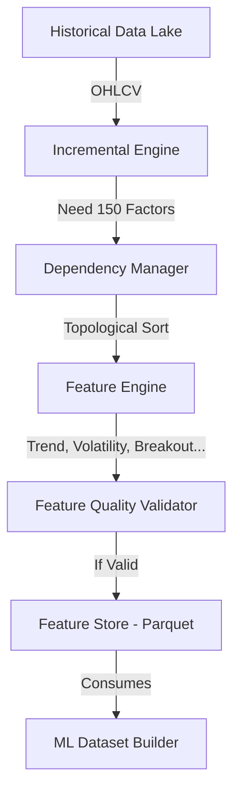

# Phase E2: Institutional Feature Engineering & Alpha Factor Platform

## Overview
Phase E2 completely replaces the legacy feature engineering scripts with an enterprise-grade **Feature Engineering Platform**. The platform is designed to compute 150-250 vectorized Alpha Factors across 13 distinct categories for the entire NSE universe. 

It guarantees:
- **No Duplicate Calculations**: Leverages a Directed Acyclic Graph (DAG) in `dependency_manager.py` to ensure topological execution order (e.g., ATR is calculated exactly once before ATR Expansion).
- **Incremental Computation**: The `incremental_engine.py` slices raw OHLCV data to only compute features for missing dates (while prepending sufficient lookback context for moving averages), drastically reducing daily processing time.
- **Data Quality Assurance**: The `feature_quality.py` validator scans resulting DataFrames for NaN spikes, infinites, and constant columns, generating a quality score before allowing downstream consumption.
- **Fast Storage**: Results are persisted to Parquet via `feature_store.py`.

## Core Alpha Categories
The engine currently supports the following vector-driven categories:
1. `trend_features`: EMAs, SMAs, Golden/Death crosses, Ribbon distance.
2. `momentum_features`: RSI, MACD, PPO, Rate of Change (ROC), ADX.
3. `volatility_features`: ATR, ATR Expansion, Bollinger Bands, Donchian Channels.
4. `volume_features`: OBV, MFI, Relative Volume.
5. `breakout_features`: Distance from 20d/50d highs, NR7 compression, Inside Bars.
6. `candlestick_features`: Doji, Marubozu, Engulfing, Gap percentages.
7. `statistical_features`: Z-Scores, Rolling Skewness, Rolling Kurtosis.
8. `time_features`: Day of Week, Month, Quarter.

*(Note: Market, Tradability, News, and Portfolio features currently serve as join placeholders to be populated by subsequent microservices).*

## Architecture Flow

## API & UI
- **APIs**: Exposes `/api/features/` and `/api/features/registry` to list available factors and trigger recalculations.
- **UI**: Added `FeatureIntelligence.jsx` to the AI Platform sidebar, providing a dashboard to track the ~200 features, dependency resolution status, and global quality scores.
